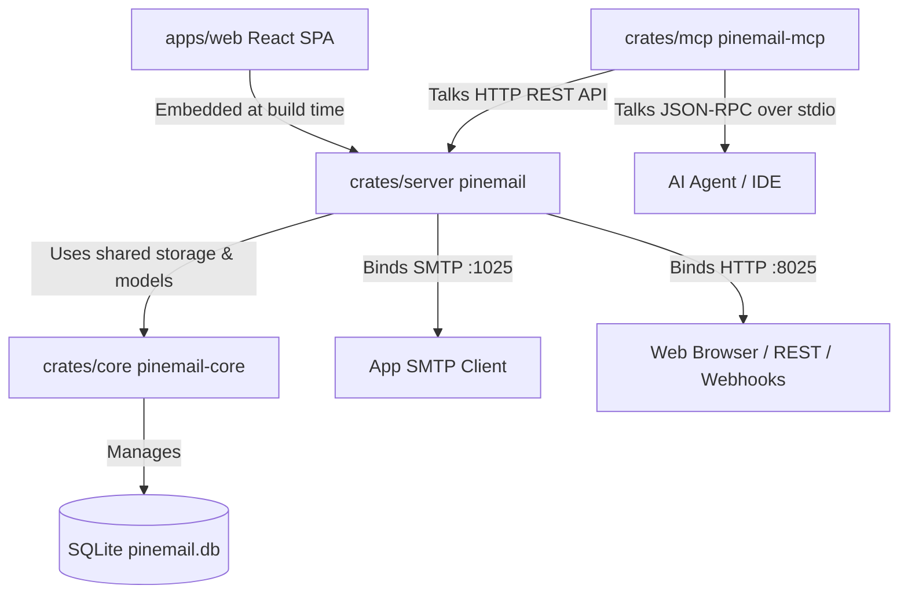
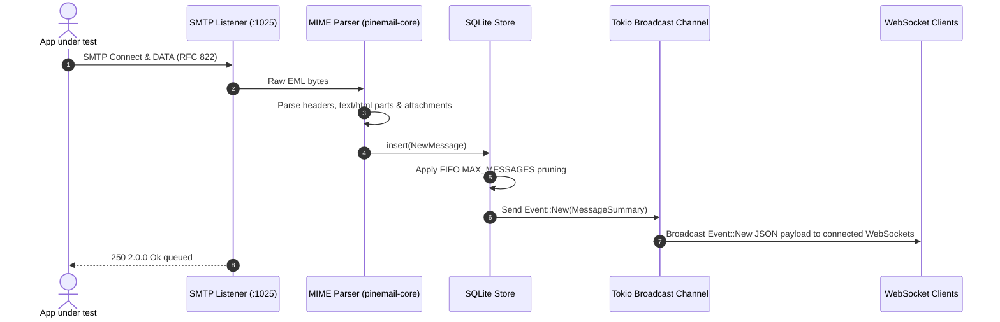
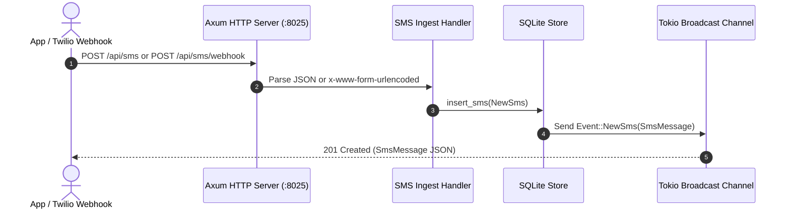
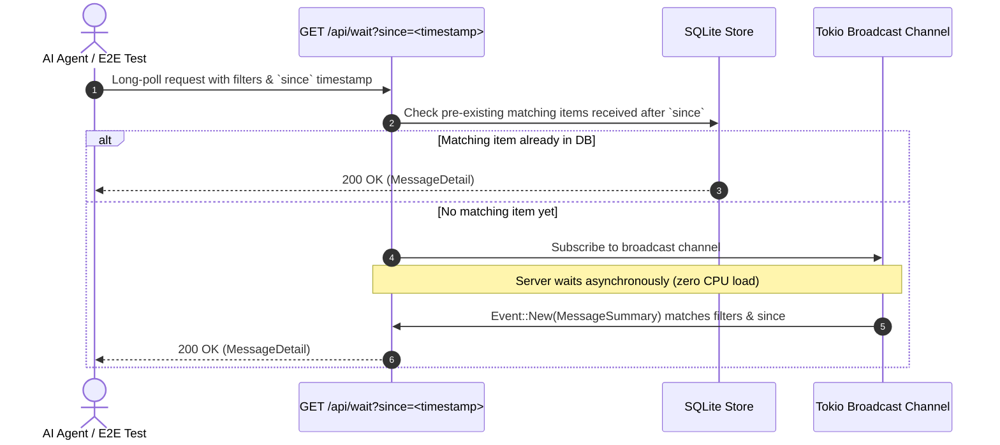

# Pine Mail Architecture & Technical Reference

Pine Mail is a lightweight, single-binary **SMTP & SMS mail catcher** built in Rust and designed specifically for modern web application development and autonomous AI agent workflows (e2e testing, authentication flow automation, OTP verification).

---

## 1. Executive Summary & Core Design Goals

1. **Single Static Binary**: Compiles into a single self-contained executable with the React single-page frontend embedded directly into the binary using `rust-embed`. Requires no external runtime dependencies (Node, JVM, or web servers).
2. **Dual Email & SMS Catcher**: Captures both SMTP emails (on port `1025`) and SMS messages via JSON REST payloads or Twilio-compatible webhooks (on port `8025`).
3. **Agentic-First Architecture**: Features server-side long-polling (`/api/wait` and `/api/sms/wait`) and signal extraction engines (`/api/messages/:id/extract` and `/api/sms/:id/extract`) for zero-polling, deterministic automated test suites.
4. **Litmus-Style Email Analysis**: Includes a built-in HTML client compatibility checker (`analyze_html`) and heuristic spam scoring engine (`analyze_spam`), exposed via `GET /api/messages/:id/analysis`.
5. **Model Context Protocol (MCP)**: Includes a companion stdio binary (`pinemail-mcp`) exposing 14 tools to AI coding agents (Claude, Copilot, Cursor, etc.).
6. **Zero External Network Dependencies**: All data stays local in a SQLite database (`/data/pinemail.db` or in-memory `:memory:`).

---

## 2. Monorepo Architecture

Pine Mail is structured as a Cargo workspace with four main components:

```
pine-mail/
├── crates/
│   ├── core/     (pinemail-core)   — Shared storage engine, SQLite models, MIME parsing, HTML/spam analysis, signal extraction
│   ├── server/   (pinemail)        — Async Axum HTTP server, SMTP server on :1025, WebSocket bus, web UI embedding
│   └── mcp/      (pinemail-mcp)    — Stdio JSON-RPC 2.0 MCP server wrapping the REST API
├── apps/
│   └── web/                        — React + Vite + TS + Tailwind UI embedded into `pinemail` binary
├── Cargo.toml                      — Workspace root definition
└── Dockerfile / docker-compose.yml
```

### Component Breakdown & Dependency Boundaries



> **Design Constraint**: `crates/server` and `crates/mcp` both depend on `crates/core` for domain models and regex engines. `crates/mcp` never accesses the SQLite database file directly; it communicates exclusively over HTTP to `crates/server`. This allows `pinemail-mcp` to run locally while `pinemail` runs in Docker or on a remote server.

---

## 3. Storage & Data Model

`pinemail-core` manages SQLite database connections using `rusqlite` with WAL mode enabled (`PRAGMA journal_mode = WAL; PRAGMA synchronous = NORMAL;`) and busy timeouts for thread-safe concurrent operations.

### Exact Database Schema DDL

```sql
-- Captured SMTP Emails
CREATE TABLE IF NOT EXISTS messages (
    id TEXT PRIMARY KEY,
    from_addr TEXT NOT NULL,
    to_addrs TEXT NOT NULL,        -- JSON array string of recipient addresses
    subject TEXT NOT NULL,
    size INTEGER NOT NULL,
    received_at TEXT NOT NULL,     -- ISO 8601 / RFC 3339 timestamp with milliseconds
    read INTEGER NOT NULL DEFAULT 0,
    has_html INTEGER NOT NULL DEFAULT 0,
    has_attachments INTEGER NOT NULL DEFAULT 0,
    raw BLOB NOT NULL              -- Full raw RFC 822 MIME message bytes
);

CREATE INDEX IF NOT EXISTS idx_messages_received_at ON messages(received_at);

-- Captured SMS Messages
CREATE TABLE IF NOT EXISTS sms (
    id TEXT PRIMARY KEY,
    from_phone TEXT NOT NULL,      -- Sender phone number or identifier
    to_phone TEXT NOT NULL,        -- Recipient phone number or identifier
    body TEXT NOT NULL,            -- Message text content
    received_at TEXT NOT NULL,     -- ISO 8601 / RFC 3339 timestamp with milliseconds
    read INTEGER NOT NULL DEFAULT 0
);

CREATE INDEX IF NOT EXISTS idx_sms_received_at ON sms(received_at);
```

### Automatic Capacity Maintenance & FIFO Pruning

Pine Mail implements automated capacity management via the `MAX_MESSAGES` configuration parameter (default: 1000):

- Whenever a new email is inserted, if `MAX_MESSAGES > 0`, the store deletes the oldest messages where `COUNT(*) > MAX_MESSAGES`.
- SMS messages are independently pruned using the same `MAX_MESSAGES` ceiling.
- Memory storage (`DB_PATH=:memory:`) follows identical pruning logic in SQLite memory databases.

---

## 4. Ingestion Pipelines & Real-Time Event Architecture

### 4.1 SMTP Email Ingestion Flow



### 4.2 SMS Ingestion Flow (REST & Webhook)

Pine Mail supports two ingestion formats for SMS:
1. Standard JSON payload (`{"from": "+1555...", "to": "+1800...", "body": "Your code is 123456"}`)
2. Form-urlencoded Twilio Webhook (`From=+1555...&To=+1800...&Body=Your+code+is+123456`)



### 4.3 WebSocket Event Bus (`/api/events`)

The backend maintains a `tokio::sync::broadcast` channel. When messages or SMS arrive or are updated, events are broadcast to connected WebSocket clients (`ws://localhost:8025/api/events`):

- `Event::New(MessageSummary)`
- `Event::Deleted { id }`
- `Event::BulkDeleted { ids }`
- `Event::Cleared`
- `Event::Read { id, read }`
- `Event::BulkRead { ids, read }`
- `Event::NewSms(SmsMessage)`
- `Event::SmsDeleted { id }`
- `Event::BulkSmsDeleted { ids }`
- `Event::SmsCleared`
- `Event::SmsRead { id, read }`
- `Event::BulkSmsRead { ids, read }`

---

## 5. Agentic & E2E Integration Engine

Pine Mail provides specialized primitives for AI agents and automated testing suites: **Long-Polling Wait**, **Signal Extraction**, and **Email Analysis**.

### 5.1 Long-Polling Wait Mechanism (`/api/wait` & `/api/sms/wait`)

Instead of requiring client-side retry loops or sleep timers, the `/api/wait` and `/api/sms/wait` endpoints hold the HTTP request open server-side (up to `timeout_ms`, default 10s, max 60s) using Tokio channels:



> [!IMPORTANT]
> **Timestamp Synchronization Requirement**: Always record `since` *before* initiating the user action that triggers an email/SMS. If `since` is captured after calling the backend API, the message might arrive in the millisecond window before `/api/wait` is invoked and be filtered out.

### 5.2 Signal Extraction Engine (`pinemail-core::mail`)

Pine Mail scans captured text and HTML bodies with regular expressions to extract verification payloads:

- **Verification / OTP Codes**: Matches 4-8 digit numerical sequences or alphanumeric codes (e.g., `482913`, `A-940218`).
- **Action Links**: Matches `https?://` URLs, stripping trailing punctuation, tracking pixels, and unsubscribes.

API Endpoints:
- `GET /api/messages/:id/extract` -> `{"codes": ["482913"], "links": ["https://app.test/verify?token=abc"]}`
- `GET /api/sms/:id/extract` -> `{"codes": ["193049"], "links": ["https://app.test/m/xyz"]}`

### 5.3 Litmus-Style Email Analysis Engine (`pinemail-core::analysis`)

`GET /api/messages/:id/analysis` performs 11 automated HTML email-client compatibility checks and SpamAssassin-style heuristic spam scoring:

- **HTML Client Checks**: DOCTYPE, table layout structure, inline CSS usage, external stylesheets, JavaScript presence, web fonts, background images, viewport meta tag, character encoding, image alt text, and HTML size clipping (>102KB Gmail threshold).
- **Spam Scoring**: Trigger words, uppercase subjects, exclamation counts, empty subjects, missing text alternatives, image-to-text ratios, URL shorteners, missing List-Unsubscribe headers, and risky attachments (`.exe`, `.js`, etc.).

---

## 6. Complete REST API Endpoint Directory

### Email Endpoints

| Method | Endpoint | Description |
|---|---|---|
| `GET` | `/api/messages` | List emails (`search`, `limit`, `offset`) |
| `GET` | `/api/messages/:id` | Get email details (text/html body, headers, attachments) |
| `GET` | `/api/messages/:id/raw` | Download raw `.eml` source file |
| `GET` | `/api/messages/:id/html` | Render raw HTML body |
| `GET` | `/api/messages/:id/attachments/:index` | Download attachment file by index |
| `GET` | `/api/messages/:id/extract` | Extract OTP codes and URLs from email body |
| `GET` | `/api/messages/:id/analysis` | HTML compatibility checks & heuristic spam score |
| `GET` | `/api/wait` | Long-poll server-side for matching email |
| `PATCH` | `/api/messages/:id/read` | Toggle read/unread state |
| `DELETE` | `/api/messages/:id` | Delete single email by ID |
| `POST` | `/api/messages/bulk-delete` | Bulk delete emails (`{"ids": [...]}`) |
| `PATCH` | `/api/messages/bulk-read` | Bulk mark read (`{"ids": [...], "read": true}`) |
| `DELETE` | `/api/messages` | Clear all emails |
| `POST` | `/api/test-email` | Deliver synthetic test email |

### SMS Endpoints

| Method | Endpoint | Description |
|---|---|---|
| `GET` | `/api/sms` | List SMS messages (`search`, `limit`, `offset`) |
| `GET` | `/api/sms/:id` | Get single SMS by ID |
| `POST` | `/api/sms` | Ingest SMS via JSON payload |
| `POST` | `/api/sms/webhook` | Ingest SMS via Twilio form-urlencoded or JSON |
| `GET` | `/api/sms/wait` | Long-poll server-side for matching SMS |
| `GET` | `/api/sms/:id/extract` | Extract OTP codes and URLs from SMS body |
| `PATCH` | `/api/sms/:id/read` | Toggle read/unread state |
| `DELETE` | `/api/sms/:id` | Delete single SMS by ID |
| `POST` | `/api/sms/bulk-delete` | Bulk delete SMS (`{"ids": [...]}`) |
| `PATCH` | `/api/sms/bulk-read` | Bulk mark read (`{"ids": [...], "read": true}`) |
| `DELETE` | `/api/sms` | Clear all SMS messages |
| `POST` | `/api/test-sms` | Deliver synthetic test SMS |

### System Endpoints

| Method | Endpoint | Description |
|---|---|---|
| `GET` | `/api/config` | Returns server metadata (`version`, `smtp_port`, `http_port`) |
| `GET` | `/api/events` | WebSocket live event stream |

---

## 7. Model Context Protocol (MCP) Integration

`crates/mcp/src/main.rs` implements a zero-dependency JSON-RPC 2.0 stdio MCP server (`pinemail-mcp`).

### Available MCP Tools (14 Tools)

| Category | Tool Name | Parameters | Description |
|---|---|---|---|
| **Email** | `list_emails` | `search?`, `limit?`, `offset?` | Query emails with search filter, limit, and offset |
| | `get_email` | `id` | Fetch full message headers, text/html content, and attachments |
| | `wait_for_email` | `to?`, `from?`, `subject?`, `since_ms?`, `timeout_ms?` | Server-side long-poll for fresh matching email |
| | `extract_signals` | `id` | Extract OTP codes and verification URLs from email body |
| | `send_test_email` | `to?` | Generate synthetic test email into inbox |
| | `delete_email` | `id` | Remove single email by ID |
| | `clear_inbox` | *none* | Purge all emails from store |
| **SMS** | `list_sms` | `search?`, `limit?`, `offset?` | Query SMS messages with search filter, limit, and offset |
| | `get_sms` | `id` | Fetch single SMS message by ID |
| | `wait_for_sms` | `to?`, `from?`, `body?`, `since_ms?`, `timeout_ms?` | Server-side long-poll for fresh matching SMS |
| | `extract_sms_signals`| `id` | Extract OTP codes and URLs from SMS body |
| | `send_test_sms` | `to?`, `from?`, `body?` | Generate synthetic test SMS message |
| | `delete_sms` | `id` | Remove single SMS message by ID |
| | `clear_sms_inbox` | *none* | Purge all SMS messages from store |

---

## 8. Configuration Parameters

Pine Mail relies on environment variables for execution settings:

| Variable | Type | Default | Description |
|---|---|---|---|
| `SMTP_PORT` | u16 | `1025` | Port bound by the SMTP server |
| `HTTP_PORT` | u16 | `8025` | Port bound by Axum HTTP API & embedded UI |
| `BIND_ADDR` | String | `0.0.0.0` | Network address bound by services |
| `DB_PATH` | String | `pinemail.db` (`/data/pinemail.db` in Docker) | Path to SQLite database file (`:memory:` for ephemeral) |
| `MAX_MESSAGES` | u64 | `1000` | FIFO count ceiling for stored items (`0` = unlimited) |
| `SMTP_HOSTNAME`| String | `pinemail` | Hostname announced in SMTP EHLO banner |
| `PINEMAIL_URL` | String | `http://127.0.0.1:8025` | Target HTTP base URL used by `pinemail-mcp` |
